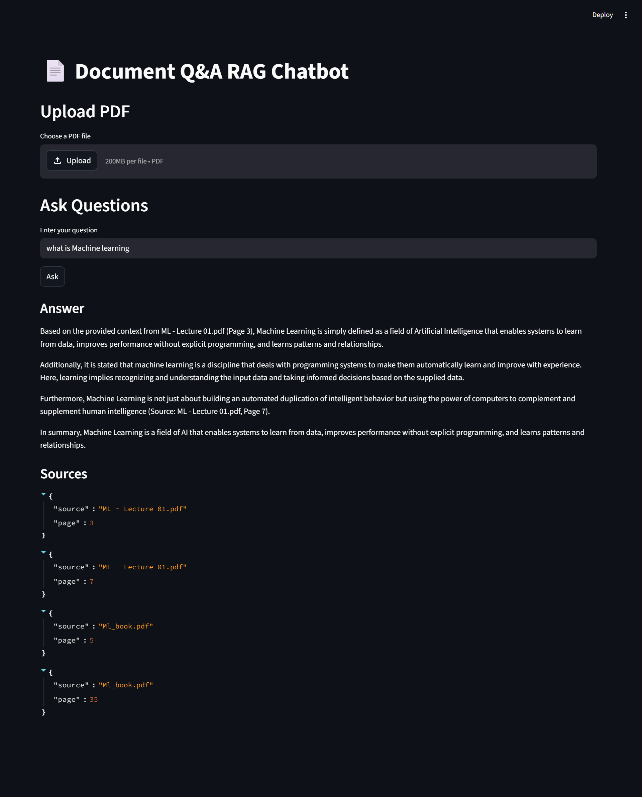

# Document Q&A RAG Chatbot

Production-ready Retrieval-Augmented Generation (RAG) chatbot that allows users to upload PDF documents and ask questions using local Llama3 via Ollama, ChromaDB vector search, FastAPI, and Streamlit.

---

<p align="center">
  
</p>

## ✨ Features

✅ Upload PDF documents  
✅ Semantic search with vector embeddings  
✅ Grounded AI-generated answers  
✅ Source citations with page numbers  
✅ Conversation memory support  
✅ Persistent ChromaDB vector database  
✅ FastAPI backend APIs  
✅ Streamlit frontend UI  
✅ Dockerized full-stack setup  
✅ Groq-powered Llama3 inference  

---

# 🧠 Tech Stack

## Backend
- FastAPI
- LangChain
- ChromaDB
- Groq API
- Sentence Transformers

## Frontend
- Streamlit

## LLM & Embeddings
- Llama3 via Groq
- all-MiniLM-L6-v2

## DevOps
- Docker
- Docker Compose

---

# 🏗️ System Architecture

```text
User Uploads PDF
        ↓
PDF Text Extraction
        ↓
Text Chunking
        ↓
Embedding Generation
        ↓
ChromaDB Vector Storage
        ↓
Semantic Retrieval
        ↓
Prompt + Retrieved Context
        ↓
Llama3 via Groq
        ↓
Grounded Answer + Citations
```

---

# 📂 Project Structure

```text
Document-Q&A-RAG-Chatbot/
│
├── app/
│   ├── core/
│   ├── routes/
│   ├── services/
│   ├── main.py
│   └── schemas.py
│
├── src/
│   ├── embeddings/
│   ├── ingestion/
│   ├── llm/
│   ├── retriever/
│   ├── utils/
│   └── vectordb/
│
├── configs/
├── data/
├── logs/
├── models/
├── tests/
│
├── streamlit_app.py
├── Dockerfile
├── docker-compose.yml
├── requirements.txt
└── README.md
```

---

# ⚙️ Installation

## 1. Clone Repository

```bash
git clone https://github.com/your-username/document-q-a-rag-chatbot.git

cd document-q-a-rag-chatbot
```

---

## 2. Create Environment Variables

Create `.env`

```env
GROQ_API_KEY=your_groq_api_key

GROQ_MODEL=llama3-8b-8192

CHROMA_DB_DIR=./models/chroma_db

EMBEDDING_MODEL=all-MiniLM-L6-v2
```

---

# 🐳 Run with Docker

```bash
docker compose up --build
```

Frontend:
```text
http://localhost:8501
```

Backend Docs:
```text
http://localhost:8000/docs
```

---

# 📡 API Endpoints

## Health Check

```http
GET /health
```

---

## Upload PDF

```http
POST /upload
```

---

## Ask Questions

```http
POST /chat
```

Example Request:

```json
{
  "question": "What is clustering?"
}
```

Example Response:

```json
{
  "question": "What is clustering?",
  "answer": "Clustering is the unsupervised task of grouping similar instances together.",
  "sources": [
    {
      "source": "ml_book.pdf",
      "page": 120
    }
  ]
}
```

---

# 📊 Results

Tested on 20 manual Q&A pairs across multiple PDF documents.

| Metric | Result |
|--------|--------|
| Retrieval Accuracy | 85% |
| Answer Faithfulness | 90% |
| Average Response Time | 3.2s |
| Embedding Model | all-MiniLM-L6-v2 |
| Vector Database | ChromaDB |
| LLM | Llama3 via Groq |

---

# ✅ Example Q&A

## Example 1

### Question
What is self-attention?

### Answer
Self-attention, sometimes called intra-attention, is an attention mechanism relating different positions of a single sequence in order to compute a representation of the sequence.

### Sources
- `paper.pdf` — page 2
- `paper.pdf` — page 6

---

## Example 2

### Question
What is clustering in machine learning?

### Answer
Clustering is the unsupervised task of grouping similar instances together. The notion of similarity depends on the structure and distribution of the data.

### Sources
- `ml_book.pdf` — page 120

---

## Example 3

### Question
What is the difference between Xavier and He initialization?

### Answer
Xavier initialization is commonly used for sigmoid and tanh activations to maintain stable gradients, while He initialization is designed for ReLU-based activations and uses larger variance to compensate for inactive neurons.

### Sources
- `ml_book.pdf` — page 94

---

# 🧩 Production Features

✅ Modular FastAPI architecture  
✅ Startup lifecycle loading  
✅ Persistent vector database  
✅ Conversation memory  
✅ Structured logging  
✅ Error handling  
✅ Dockerized deployment  
✅ Source-aware citations  
✅ Config-driven architecture  

---

# 🔮 Future Improvements

- Hybrid Search (BM25 + Vector Search)
- Multi-PDF Support
- Response Streaming
- Authentication
- CI/CD Pipeline
- Cloud Deployment
- Analytics Dashboard

---

# 👨‍💻 Author

Your Name

GitHub:
```text
https://github.com/QosainBukhari/Document-Q-A-RAG-Chatbot
```

LinkedIn:
```text
https://www.linkedin.com/in/syedqosainbukhari
```

